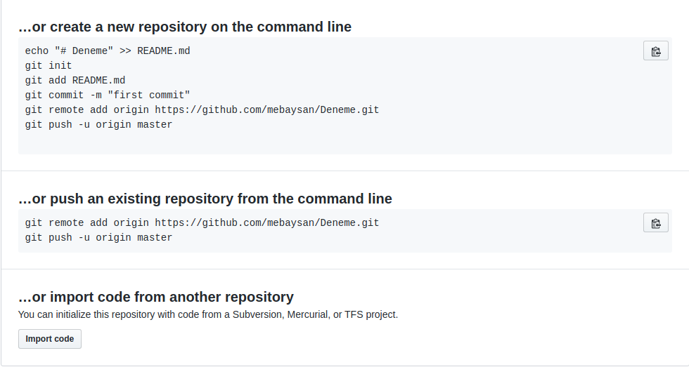
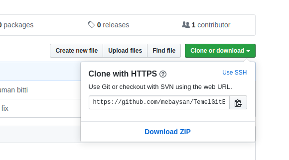

# İçindekiler
- [İçindekiler](#i̇çindekiler)
- [Giriş](#giriş)
- [Git Nedir?](#git-nedir)
- [Temel Git Terimleri](#temel-git-terimleri)
- [Kurulum](#kurulum)
- [Temel Terminal/Komut İstemcisi Bilgisi](#temel-terminalkomut-i̇stemcisi-bilgisi)
    - [Git CLI (Command Line Interface / Komut İstemcisi) Test Edelim](#git-cli-command-line-interface--komut-i̇stemcisi-test-edelim)
- [Git'e Giriş](#gite-giriş)
      - [Ufak Bir Not](#ufak-bir-not)
- [Branch](#branch)
  - [Branch Nedir?](#branch-nedir)
  - [Peki Neden Branch'lere İhtiyaç Duyarız?](#peki-neden-branchlere-i̇htiyaç-duyarız)
      - [Ufak Bir Not](#ufak-bir-not-1)
      - [Ufak Bir Not](#ufak-bir-not-2)
  - [Branch'leri Silmek](#branchleri-silmek)
- [Conflicts (Çakışmalar)](#conflicts-çakışmalar)
- [Rebasing](#rebasing)
- [Reset (Dosyaları Eski Hallerine Döndürme)](#reset-dosyaları-eski-hallerine-döndürme)
- [STASH](#stash)
    - [Ufak Bir Not](#ufak-bir-not-3)
- [Gitignore (Dosyaları Yok Saymak)](#gitignore-dosyaları-yok-saymak)
- [Değiştirilemeyen Dosyalar](#değiştirilemeyen-dosyalar)
    - [Ufak Bir Not](#ufak-bir-not-4)
- [Dosyaları Silmek](#dosyaları-silmek)
- [Commit'leri Kopyalamak (git-cherry)](#commitleri-kopyalamak-git-cherry)
- [Alias (Takma Adlar)](#alias-takma-adlar)
- [Uzak Sunucu](#uzak-sunucu)
  - [Push - Pull Nedir?](#push---pull-nedir)
    - [Ufak Bir Not](#ufak-bir-not-5)
  - [GitHub ile devam edelim](#github-ile-devam-edelim)
  - [Clone Nedir](#clone-nedir)
- [Temel Git ve GitHub Bilgileri İçin Video](#temel-git-ve-github-bilgileri-i̇çin-video)
# Giriş
  Git kullanımımı daha efektif hale getirebilmek için **okumalar yaptım ve aldığım notları derleyerek** bu dökümanı 18/05/2020 tarihinde hazırladım. 
# Git Nedir?
Kısaca **Git** bir versiyon kontrol sistemidir diyebiliriz. Bu **açık kaynaklı** versiyon kontrol sistemi sayesinde; projelerimizin versiyon kontrol takibini yapabilir, dünya çapında projelere katkıda bulunabilir, kendi projelerimizi dünya ile paylaşabilir ve projelerimizin mobilitesini artırabiliriz. Bu sistem sayesinde, bir projede aynı anda birden fazla kişi ile çalışabilir ve bir dosyada yapılan tüm değişiklikleri görüntüleyebiliriz.
**Unutmamakta fayda var, Git != GitHub || GitLab**

# Temel Git Terimleri
- **Repository**
  - Bir diğer adıyla **Kod Deposu**. Tüm kodlarımızın tarihçelerinin barındırıldığı depodur. Proje dizinimizde  ``` git init``` diyerek bir repository oluşturabiliriz.
- **Working Directory**
  - Kısaca **Çalışma Alanı**. Projemizin ana dizinidir. Bir dosyanın/klasörün **Working Directory**'de bulunması o dosyanın **Git** tarafından takip edildiği anlamına gelmez. Sadece **Staging Area**'daki dosyalar **Git** tarafından takip edilir.
- **Staging Area**
  - **Git** tarafından **takip edilen** dosyalar burada bulunur. Gerçek manada **fiziki bir alan değildir**. Dosyalarımızın durumunu belirten hayali bir ortam olarak düşünebiliriz. 
- **Commit**
  - Kısaca **Taahhüt** veya **Sözleşme** diyebiliriz. Bir dosyada yaptığımız değişikliklerin kalıcı değişiklikler olduğunun taahhüdünü vermemiz, sözleşmeyi imzalamamız gerekmektedir. Böyle ilgili dosya/dizinde yaptığımız değişiklikler **repository**'mize kaydedilir.

# Kurulum
[Git](https://git-scm.com/)'in official web sitesi üzerinden kurulum dosyasını indirebiliriz. Eğer ki Linux kullanıcısı isek (Debian tabanlı dağıtımlar için) `apt-get install git` diyerek sistemimize Git'i kurabiliriz.
- Git versiyon kontrol sisteminin yine Git ile kontrol edildiğini de belirtmekte fayda var :blush:


# Temel Terminal/Komut İstemcisi Bilgisi
- **Terminal Nasıl Açılır?**
  - **Linux** Dağıtımlar:
    - **CTRL + ALT + T** tuş kombinasyonu ile Terminal açılabilir (Gnome masaüstünü kullananlar için). Uygulamalar penceresinden de Terminal'i seçerek açabilirsiniz
  - **OS X**:
    - **cmd + space(boşluk)** tuş kombinasyonu ile Spotlight'ı açtıktan sonra **Terminal** yazıp Enter'a basarak açabilirsiniz.
  - **Windows**:
    - **ALT + R** tuş kombinasyonu sayesinde açılan pencerede **cmd** yazarak erişebilirsiniz.
- **Terminal** Nedir?
  - Kısaca Terminal; kullanıcıların **sadece** klavye ve ekran yardımıyla işletim sistemi veya yazılımları kontrol etmesini veya yönetmesine yardım eden **komut ekranı**dır. 
- `mkdir`
  - Komut ekranımızda `mkdir dizin_adi` komutunu çalıştırır ve argüman olarak **dizin_adi** 'nı yollarsak bulunduğumuz dizinde '**dizin_adi**' adında bir klasör oluşturacaktır.
- `ls`
  - Komut ekranımızda `ls` komutunu çalıştırırsak bize bulunduğumuz dizindeki mevcut dizinleri, dosyaları listeleyecektir.
  ```
   ls
  >>>  Desktop  Documents  Downloads  go  Music  node  Pictures  Postman  Public  pycharm  Templates  Videos  'VirtualBox VMs'
   ``` 
- `pwd`
  - Komut ekranımızda `pwd` komutunu çalıştırırsak bize hangi dizinde bulunduğumuzu verecektir.
  ```
  pwd
  >>> /root/Desktop/GIT-EL-KITAP
  ```
### Git CLI (Command Line Interface / Komut İstemcisi) Test Edelim
Git'i sistemimize kurduktan sonra, komut istemcimizde `git --version` komutunu çalıştırdığımızda bize sistemimizde yüklü olan Git'in versiyonunu döndürecektir.(Versiyonlarda farklılık olabilir. Herhangi bir versiyonu döndürüyorsa tebrik ederim, Git'i başarılı bir şekilde kurdunuz demektir :sunglasses:)
```
git --version
>>> git version 2.26.2
```

# Git'e Giriş
- Bir projemiz olduğunu varsayalım. `cd` komutu sayesinde Git reposu (repository) oluşturmak istediğimiz dizine gidiyoruz.
```
cd Desktop/projedizinim/ 
```
- Ardından `ls` komutu sayesinde dizinimizdeki dosyaları/klasörleri listeleyebiliriz.
```
ls
>>> intro.py
```
- `git init` komutu sayesinde mevcut dizinimizde bir Git Repository'si oluşturabiliriz ve sonrasında boş bir Git Reposu oluşturuldu şeklinde çıktı alacağız.
```
git init
>>> Initialized empty Git repository in /root/Desktop/projedizinim/.git/
```
- Artık **projedizinim** altındaki dosyalar Git ile takip edilebilirler. Fakat **henüz takip edilmiyorlar**:exclamation: Bunun sebebini aslında yukarıda belirtmiştik. **projedizinim** bizim Working Directory'miz yani çalışma alanımız. Fakat biz ne demiştik? Bir dosyanın veya klasörün Working Directory'de olması Git tarafından takip edildiği anlamına gelmez. Bu sebeple dosyalarımızı Staging Area'ya yani Git'in takip ettiği sanal ortama **sözleşme/taahhüt** imzalayarak tanıtmamız gerekli. Bu kısa bilgiyi verdikten sonra bizim elimiz kolumuz olacak olan `git status` komutuna bakalım :muscle:
- Git reposunu oluşturduğumuz dizin altında `git status` komutunu çalıştıralım. Git status bizim elimiz kolumuz olacak. Bize repomuzun durumunu anlatırken aynı zamanda yapmak isteyeceğimiz işlemlerin komutlarını da hatırlatır :innocent:
```
git status
>>> On branch master

No commits yet

Untracked files:
  (use "git add <file>..." to include in what will be committed)
        intro.py

nothing added to commit but untracked files present (use "git add" to track)
```
- Git `intro.py` adlı dosyamızı gördü fakat henüz takip etmiyor. Bu sebeple **Untracked files** yani **Takip edilmeyen dosyalar** altında listeledi. Şimdi Git'e bu dosyayı takip et, yani **Staging Area**'ya al dememiz gerekiyor.
- `git add dosya_adi` komutunu kullandığımızda ilgili dosyayı Staging Area'ya ekler ve takip etmeye başlar.
```
git add intro.py # benim repoma eklemek istediğim dosyanın adı intro.py siz de kendi dosyanızı argüman olarak yollamalısınız ^^
``` 
- Şimdi tekrar Git repomuzun durumuna bakalım
```
git status
>>> On branch master

No commits yet

Changes to be committed:
  (use "git rm --cached <file>..." to unstage)
        new file:   intro.py
```
- Git artık dosyalarımızı takip ediyor fakat bu sefer de bize diyorki 'Bu dosyada değişiklikler var ama henüz **commit** edilmemiş'. Yani yaptığımız değişiklikler için sözleşme imzalamamızı istiyor. Bunu da `git commit -m "ilk commit"` komutu sayesinde yapabiliriz. `git commit -m` komutuna argüman olarak yolladığımız string bizim sözleşmemizin açıklama metni olacaktır. Log kayıtlarında bu şekilde görüntülenecek. Bizim ilk denememiz olduğu için "ilk commit" şeklinde bir açıklama yaptık. Tabii ki gerçek bir proje üzerinde çalışsaydık takım arkadaşlarımızın bilgilenmesi için yaptığımız değişikliği açıklayan nitelikte bir açıklama yazmamız daha hoş olurdu.
```
git commit -m "ilk commit"
>>> [master (root-commit) 62cf9b5] ilk commit
 1 file changed, 1 insertion(+)
 create mode 100644 intro.py
```
- Eğer Git'i ilk defa kurduysak bu aşamada git bizden kendimizi tanıtmamızı isteyecektir. Bunun sebebi ise oluşturduğumuz **commitler**i (sözleşmeleri) bizim adımıza oluşturacak ve Repository üzerinde kimin değişiklik/güncelleme yaptığının bilgisini tutacaktır. Sistemimizde **tek seferlik** bu konfigürasyonu yapmamız gerekmekte. Gerçek bilgiler olması önemlidir :exclamation:
```
git config --global user.name "ad soyad"
git config --global user.email "mail adresi"
```
- Konfigürasyonları yaptıktan sonra tekrar commit etmeyi deniyoruz (eğer kendimizi tanıtmamız istenmişse). Ve hayırlı olsun ilk commitiniz başarıyla sonuçlandı :innocent:
```
git commit -m "ilk commit"
>>> [master (root-commit) 62cf9b5] ilk commit
 1 file changed, 1 insertion(+)
 create mode 100644 intro.py
```
#### Ufak Bir Not
  - Commit'ler ile ilgili; her bir commit'in tek bir göreve hizmet etmesi daha hoş olacaktır. `intro.py` dosyasıyla ilgili bir commit yaptığımızda bu commit `intro2.py` dosyasıyla ilgili commiti içermemesi gerekir. İçerse hata alır mıyız? Tabii ki hayır, fakat yönetilebilirlik ve kontrol açısından her commit'in kendi amacına hizmet etmesi daha hoş olacaktır.
- Demiştik ki `git status` bizim elimiz kolumuz olacak. Şimdi `intro.py` dosyamızda rastgele değişiklik yapalım ve ardından `git status` komutunu çalıştıralım.
```
git status
>>> On branch master
Changes not staged for commit:
  (use "git add <file>..." to update what will be committed)
  (use "git restore <file>..." to discard changes in working directory)
        modified:   intro.py

no changes added to commit (use "git add" and/or "git commit -a")
```
- Gördüğümüz gibi Git bize hangi dosyalarda değişiklik olmuş, repomuzda neler olmuş bitmiş bunların raporunu vermekte. Buradan anladığımız kadarıyla da `intro.py` değiştirilmiş/güncellenmiş fakat  **henüz commit edilmemiş**. `git status` komutu zaten bize ne yapmamız gerektiğini söylüyor. Biz `git add` komutunu zaten görmüştük. Dilerseniz bir de `git restore dosya_adi` komutunu görelim. Bu komut argüman olarak verdiğimiz dosyadaki değişiklikleri **bir önceki commit**teki haline çevirecektir.
```
git restore intro.py
git status
>>> On branch master
nothing to commit, working tree clean
``` 
- `intro.py` dosyamızdaki değişiklikleri bir önceki committeki haline çevirdik ve tekrar `git status` ile repomuzun durumunu sorguladık. Bize herhangi bir değişiklik olmadığını söyledi. Çünkü `git restore intro.py` ile dosyamızı bir önceki committeki haline çevirmiştik.
- Şimdi tekrar dosyamızda değişiklik yapalım ve farzedelim ki kodlarımızda her şey yolunda ve bunu prod'a yollayabiliriz. Değişikliklerden sonra tekrar **staging area**'ya ekleyelim ve **commit (sözleşme/taahhüt)** edelim.
```
git status
>>> On branch master
On branch master
Changes not staged for commit:
  (use "git add <file>..." to update what will be committed)
  (use "git restore <file>..." to discard changes in working directory)
        modified:   intro.py

no changes added to commit (use "git add" and/or "git commit -a")

git add intro.py

git commit -m "hello world fonksiyonu eklendi"

>>> [master 000d29e] hello world fonksiyonu eklendi
 1 file changed, 1 insertion(+), 1 deletion(-)

```
- Siz de takdir edersiniz ki dosyalarımızın sadece çalışır ve olmasını istediğimiz hallerini commit ettik. **Her zaman dosyalarımızın en son, çalışır hallerini commit etmeliyiz.** Aksi takdirde prod kısmında kodlarımızı güncellediğimizde kötü sonuçlar ile karşılaşmamız kaçınılmazdır :anguished:
- Şimdi bir de repository'miz üzerinde daha önce neler olmuş bitmiş, hangi tarihte ne değişiklikler yapmışız dilerseniz bunları görelim. Bunun için `git log` komutunu kullanmamız yeterlidir.
```
git log
>>> commit 000d29e2fa8d89a98336f3be97d08e45a450769f (HEAD -> master)
Author: mebaysan <menesbaysan@gmail.com>
Date:   Sun May 17 19:45:31 2020 +0300

    hello world fonksiyonu eklendi

commit 62cf9b59f0380115aaea2201c36d6a8a2d781455
Author: mebaysan <menesbaysan@gmail.com>
Date:   Sun May 17 19:20:47 2020 +0300

    ilk commit
  
``` 
- Hangi commit'te ne gibi değişiklikler olmuş dilersek bunları görebiliriz. `git diff commit_id` komutunu `git log` komutunun çıktısında gelen commit loglarının yanındaki id'leri argüman olarak yollayarak kullanabiliriz. Gelin **ilk commit**'ten sonra ne gibi değişiklikler olmuş onları görelim. ` git diff 62cf9b59f0380115aaea2201c36d6a8a2d781455` komutunu kullanacağım. Çünkü **ilk commit**'imin id'si bende bu şekilde.
```
git diff 62cf9b59f0380115aaea2201c36d6a8a2d781455
>>> diff --git a/intro.py b/intro.py
index 8eb74cf..416a5e7 100644
--- a/intro.py
+++ b/intro.py
@@ -1 +1,3 @@
-print('Hello world')
\ No newline at end of file
+print('Hello world')
+
+print('Hello World 2')
root@covid-x:~/Desktop/pr

```
- Gördüğümüz gibi sildiğimiz satırlar satır başlarında '`-`' ile ifade edilirken, eklediğimiz satırlar ise satır başlarında '`+`' ile ifade ediliyor.
- İlk committeki haline geri dönmek istediğimizi varsayalım. `git log` ile ilgili commit'in id'sini aldıktan sonra `git checkout 62cf9b59f0380115aaea2201c36d6a8a2d781455` komutunu dönmek istediğimiz commit'in id'sini argüman olarak yollayarak kullanalım.
```
git checkout 62cf9b59f0380115aaea2201c36d6a8a2d781455
>>> Warning: you are leaving 1 commit behind, not connected to
any of your branches:

  382cfe1 ds1

If you want to keep it by creating a new branch, this may be a good time
to do so with:

 git branch <new-branch-name> 382cfe1

HEAD is now at 62cf9b5 ilk commit
```
- Şimdi repository'miz id'sini verdiğimiz (`62cf9b59f0380115aaea2201c36d6a8a2d781455`) commit'teki haline geri döndü. Tekrar son commit'teki haline çevirmek istersek aynı komutu ilgili commit id'sini argüman olarak yollayarak kullanabiliriz.
  
# Branch

## Branch Nedir?
Git commit'lerimizi şimdiye kadar hep lineer bir yapıda tuttuk. Fakat Git'in yetenekleri bundan daha fazlasını yapmasına yardım ediyor. Git, commit'leri sadece tek bir dalda değil, birden fazla dal içerebilen bir **ağaç** yapısında tutabilir. Böylece iki ayrı dal (iki ayrı modül) üzerinde çalışabilir ve işimiz bittiğinde bu dalları birleştirerek tek bir dala sahip olabiliriz.
- Default olarak gelen branch'imizin adı `master`'dır.
  
## Peki Neden Branch'lere İhtiyaç Duyarız?
Projelerimiz çoğu zaman tek bir çizgi üzerinde ilerlemez. Eş zamanlı olarak projemizin farklı modülleri üzerinde çalışmak isteyebiliriz, farklı bug fix'leri üzerinde aynı anda çalışmak isteyebiliriz veya web sayfalarımızın birden fazla versiyonunu hazırlayıp test etmek isteyebiliriz. Bu gibi durumlarda projemizin sağlıklı çalışır bir versiyonunu (**branch**) elimizde bulundurmak isteriz. Default olarak gelen `master` branch'imizi **ana** branch'imiz olarak düşünelim. İki farklı dala ayırıp Modül1 üzerinde ve Modül2 üzerinde eş zamanlı olarak çalışabiliriz. Modül2'nin yazımı bittikten sonra Modül1'in yazımını beklemeden yapılan değişiklikleri master branch'e aktarabiliriz. Bu işleme ise `merge` denmektedir. Artık **master branch**'imize Modül2'de dahil olmuş oldu.
#### Ufak Bir Not
Master branch'imizde her zaman projemizin prod'a çıkabilecek bir versiyonunu bulundurmamız bizim yararımıza olacaktır.

- Bir branch oluşturmak için `git branch branch_adi` komutunu oluşturmak istediğimiz branch'in adını argüman olarak yollayarak kullanmamız gerekmektedir. Ardından `git status` ile repomuzun durumunu kontrol edelim ve hangi branch'te olduğumuza bakalım. Demiştik ki ilk git reposu oluşturulduğunda default olarak `master` branch açılır. 
```
git branch haber-listele # haber listele adında branch oluştuduk
git branch musteri-listele # müşteri listele adında branch oluştuduk
git status
>>> On branch master
nothing to commit, working tree clean
```
- Branch değiştirmek için `git checkout branch_adi` komutunu, geçmek istediğimiz branch'in adını argüman olarak vererek kullanabiliriz. Ardından tekrar `git status` ile hangi branch'te olduğumuzu görebiliriz.
```
git checkout haber-listele
>>> Switched to branch 'haber-listele'

git status
>>> On branch haber-listele
nothing to commit, working tree clean
```
- Ardından `haber_getir.py` adında bir dosyayı `haber-listele` adlı branch'ime ekleyeceğim ve sonrasında commit ettikten sonra `git log` komutu ile branch'imde yapılmış olan değişiklikleri göreceğim.
```
cat > haber_listele.py

.def haber_getir():
.        print('Haberler getiriliyor...')
.
.

git add haber_listele.py

git commit -m 'haber listeleme modulu eklendi'
>>> [haber-listele 287f583] haber listeleme modulu eklendi
 1 file changed, 3 insertions(+)
 create mode 100644 haber_listele.py

git log
>>> commit 287f5835608c07fd0569f2d371f5769e76950984 (HEAD -> haber-listele)
Author: mebaysan <menesbaysan@gmail.com>
Date:   Mon May 18 01:44:56 2020 +0300

    haber listeleme modulu eklendi

commit c374c7b8837d2e84b85e41413902898709c1d7b9 (musteri-listele, master)
Author: mebaysan <menesbaysan@gmail.com>
Date:   Mon May 18 01:34:30 2020 +0300

    proje olusturuldu

```
- Şimdi `master` branch'imize geçelim. Ardından da bu branch'te ne gibi değişiklikler olmuş ona bakalım.
```
git checkout master
>>> Switched to branch 'master'

git log
>>> commit c374c7b8837d2e84b85e41413902898709c1d7b9 (HEAD -> master, musteri-listele)
Author: mebaysan <menesbaysan@gmail.com>
Date:   Mon May 18 01:34:30 2020 +0300

    proje olusturuldu

``` 
- Gördüğümüz gibi az önce yaptığımız commit ('haber listeleme modulu eklendi') gözükmüyor. Bunun sebebi ise o commit'in `haber-listele` branch'inde olması. Henüz master branch'i ile **merge** edilmedi.
- Şimdi `musteri-listele` branch'imize geçelim ve biraz değişiklik yapalım ve commit edelim.
```
git checkout musteri-listele
>>> Switched to branch 'musteri-listele'

cat > musteri_getir.py

. def musteri_getir():
.         print('Musteriler getiriliyor..')
.
.

git add musteri_getir.py

git commit -m 'musteri getirme modulu eklendi'
>>> [musteri-listele f4b4584] musteri getirme modulu eklendi
 1 file changed, 3 insertions(+)
 create mode 100644 musteri_getir.py
```
- `haber-listele` branch'inin prod'a çıkmaya hazır olduğunu varsayalım. Ve prod branch'imiz olan master ile birleştirelim (**merge**). İki branch'i **merge** etmek için önce güncelleme yapmak istediğimiz (bu proje için master) branch'e geçelim. Ardından `git merge branch_adi` komutunu merge (birleştirmek) istediğimiz branch adını argüman olarak yollayarak kullanabiliriz. Bu işlemden sonra mevcut (master) branch'imizde ne gibi değişiklikler olmuş görelim.
```
git checkout master # güncelleme yapmak istediğimiz branch'e geçiyoruz
>>> Switched to branch 'master'

git merge haber-listele # birleştirmek istediğimiz branch'i söylüyoruz
>>> Updating c374c7b..287f583
 Fast-forward
 haber_listele.py | 3 +++
 1 file changed, 3 insertions(+)
 create mode 100644 haber_listele.py


git log
>>> commit 287f5835608c07fd0569f2d371f5769e76950984 (HEAD -> master, haber-listele)
Author: mebaysan <menesbaysan@gmail.com>
Date:   Mon May 18 01:44:56 2020 +0300

    haber listeleme modulu eklendi

commit c374c7b8837d2e84b85e41413902898709c1d7b9
Author: mebaysan <menesbaysan@gmail.com>
Date:   Mon May 18 01:34:30 2020 +0300

    proje olusturuldu
```

#### Ufak Bir Not
`git log` komutunu `--oneline` parametresi ile birlikte kullanırsak daha temiz bir çıktı alabiliriz
```
git log --oneline
>>> 287f583 (HEAD -> master, haber-listele) haber listeleme modulu eklendi
    c374c7b proje olusturuldu
```
- Gördüğümüz gibi `master` branch'imizde artık `haber-listele` branch'indeki kodlar da gelmiş bulunmakta.
- `musteri-listele` branch'i ile de işimiz bittiğini varsayalım ve onu da master branch'imiz ile merge edelim. Ardından yapılan değişiklikleri görmek için `git log` komutunu kullanalım.
```
git merge musteri-listele
>>> Merge made by the 'recursive' strategy.
 musteri_getir.py | 3 +++
 1 file changed, 3 insertions(+)
 create mode 100644 musteri_getir.py

git log --oneline

>>> 7b0af94 (HEAD -> master) Merge branch 'musteri-listele'
f4b4584 (musteri-listele) musteri getirme modulu eklendi
287f583 (haber-listele) haber listeleme modulu eklendi
c374c7b proje olusturuldu

```
- `musteri-listele` branch'indeki değişiklikleri, diğer branch'lerimizdeki değişikleri **umursamadan** merge ettik. Fakat bu sefer bir kaç farklı değişikliğin olduğu hemen gözümüze çarpmakta. `Merge branch ...` de neyin nesi? Bu ekstra commit Git tarafından oluşturulan, iki branch'in merge işlemleriyle ilgili **boş bir commit**.

## Branch'leri Silmek
`musteri-listele` ve `haber-listele` branch'lerini `master` branch'imize taşıdığımza göre artık bu branch'leri silebiliriz. Bunun için `git branch -d branch_adi` komutunu silmek istediğimiz branch'in adını argüman olarak yollayarak kullanabiliriz. Adını yolladığımız branch **silinecektir**. Eğer oluşturduğumuz branch'leri unuttuysak `git branch` komutu ile oluşturduğumuz branchleri ve hangi branch'te olduğumuzu görebiliriz.
```
git branch
>>> haber-listele
    * master # yanında yıldız olan branch, üzerinde çalıştığımız branch'dir
    musteri-listele


git branch -d haber-listele
>>> Deleted branch haber-listele (was 287f583)

git branch -d musteri-listele
>>> Deleted branch musteri-listele (was f4b4584)
```
- Branch'leri silerken endişelenmemize gerek yok. Eğer silmek istediğimiz branch başka bir branch'e merge edilmediyse git bizi uyaracaktır :innocent:

# Conflicts (Çakışmalar)
Yukarıda branch'leri **merge** ederken hep farklı dosyalar üzerinde çalıştık ve bunları merge ederken çakışma (conflict) olmadı. Git üç branch'teki üç commit'i birleştirdi. Peki ya **2 farklı branch**'te **aynı dosya/lar** üzerinde değişiklik yapsaydık?

- 2 adet branch oluşturacağım ve ikisinde de musteri.py üzerinde değişiklikler yapacağım.
```
git branch musteri-listele
git branch musteri-getir # 2 adet branch oluşturdum

git checkout musteri-listele # mevcut branch'imi değiştirdim
>>> Switched to branch 'musteri-listele'

cat >> musteri.py
. def musteri_listele():
.        print('Müşteriler listeleniyor..')
.
.

git add musteri.py 

git commit -m 'musteri_listele func eklendi'
>>> [musteri-listele 42632e0] musteri_listele func eklendi
 1 file changed, 3 insertions(+)

```
- `musteri-listele` branch'imizde değişiklikleri yaptık. Şimdi `musteri-getir` branch'inde değişiklik yapalım.
```
git checkout musteri-getir
>>> Switched to branch 'musteri-getir'

cat >> musteri.py
. def musteri_getir():
.        print('Müşteriler getiriliyor..')
.
.

git add musteri.py 

git commit -m 'musteri getir func eklendi'
>>> [musteri-getir 1cf8c90] musteri getir func eklendi
 1 file changed, 3 insertions(+)

```
- 2 farklı branch'de `musteri.py` dosyası üzerinde değişiklik yaptık. Şimdi `master` branch'imize geçip `musteri-listele` branch'ini **merge** edelim.
```
git checkout master
>>> Switched to branch 'master'

git merge musteri-listele
>>> Updating 9a39d7a..42632e0
Fast-forward
 musteri.py | 3 +++
 1 file changed, 3 insertions(+)
```
- `master` ve `musteri-listele` branch'lerini başarılı bir şekilde **merge** ettik. Şimdi de `master` ve `musteri-getir` branch'lerini merge etmeyi **deneyelim**
```
git merge musteri-getir
>>> Auto-merging musteri.py
CONFLICT (content): Merge conflict in musteri.py
Automatic merge failed; fix conflicts and then commit the result.
```
- Evet hayırlı olsun ilk **conflict (çakışma)** hatamızı aldık :blush: Git bize `musteri.py` içerisinde bir çakışma (conflict) olduğunu, bu sebeple otomatik birleştirme işlemini (merge) gerçekleştiremediğini söylüyor. Dosyamızı açarsak Git bize çakışma hakkında daha detaylı bilgi verecektir. Halihazırda Linux bir sistem kullandığım için `cat` komutu ile dosyamın içeriğini görüntüleyeceğim.
```
cat musteri.py 
>>> print('Musteriler getiriliyor')

<<<<<<< HEAD
def musteri_listele():
        print('Müşteriler listeleniyor..')
=======
def musteri_getir():
        print('Müşteriler getiriliyor..')
>>>>>>> musteri-getir
```
- Gördüğümüz gibi Git bize hangi satırlarda çakışma olduğunun bilgisini veriyor. `<<<` ve `>>>` işaretleri ile gösteriyor.
- `<<<<<<< HEAD` ile `=======` işaretleri arasındaki kısım `master` branch'ine ait mevcut durumu gösteriyor.
- `=======` ile `>>>>>>>` **merge** etmek istediğimiz branch'teki yani `musteri-getir` branch'indeki halini gösteriyor. 
- Bu noktada `<<<<<<<` ve `>>>>>>>` işaretlerini silip dosyamızı istediğimiz, çalışır haline getiriyoruz ve `conflict`'i çözmüş oluyoruz. Ardından tekrar değişen dosyayı `staging area`'ya ekliyoruz ve commit ediyoruz.
```
nano musteri.py # düzenleyeceğim dosyamı açıyorum ve içeriği aşağıdaki gibi düzenliyorum

. def musteri_listele_getir():
.        print('Müşteriler listeleniyor..')
.        print('Müşteriler getiriliyor..')
.
.

git add musteri.py # dosyamızı staging area'ya ekliyoruz
git commit -m 'conflict cozuldu' # commit ediyoruz
>>> [master 34463c6] conflict cozuldu
git status # durumu gözden geçiriyoruz
>>> On branch master
nothing to commit, working tree clean
```
- Dilersek `git log --oneline` ile neler yaptığımıza bakabiliriz.
```
git log --oneline
>>> 34463c6 (HEAD -> master) conflict cozuldu
    1cf8c90 (musteri-getir) musteri getir func eklendi
    42632e0 (musteri-listele) musteri_listele func eklendi
    9a39d7a proje olusturuldu ve musteriler.py eklendi
```
# Rebasing
Kısaca Rebase işlemi commit tarihçemizin daha temiz gözükmesini sağlar. Daha iyi anlamak için boş bir git projesi açacağım ve sırasıyla bir txt içerisine 3 adet commit atacağım.
```
cat > rebasing
. 1
.

git add rebasing

git commit -m 'commit 1' # dosya içeriğini değiştirdim ve commit1 attım
>>> [master (root-commit) 631d1fd] commit 1
 1 file changed, 1 insertion(+)
 create mode 100644 rebasing

cat >> rebasing
. 2
.

git add rebasing

git commit -m 'commit 2' # dosya içeriğini değiştirdim ve commit2 attım
>>> [master 1247fc8] commit 2
 1 file changed, 1 insertion(+)


cat >> rebasing
. 3
.

git add rebasing

git commit -m 'commit 3' # # dosya içeriğini değiştirdim ve commit3 attım
>>> [master ad28eba] commit 3
 1 file changed, 1 insertion(+)
```
- Şu anda sıralamamız şu şekilde oldu `commit1 -> commit2 -> commit3`. Bunu kanıtlamak için hemen `git log` komutunu kullanabiliriz. Ve commit3 varken `gelecek` adında bir branch açıp bu branch'te `commit4`'ü atalım
```
git log --oneline
>>>ad28eba (HEAD -> master) commit 3
1247fc8 commit 2
631d1fd commit 1

git branch gelecek
git checkout gelecek
>>> Switched to branch 'gelecek'

cat >> rebasing 
. 4
.

git add rebasing

git commit -m 'commit 4'
>>> [gelecek 3d467a3] commit 4
 1 file changed, 1 insertion(+)
```
- Şu anda `gelecek` branch'imizde `commit1 -> commit2 -> commit3 -> commit4` şeklinde bir yapı oluştu.
- Tekrar `master` branch'imize geçelim ve `commit5` ile `commit6`'yı atalım.
```
git checkout master
>>> Switched to branch 'master'

cat >> rebasing
. 5
.

git add rebasing

git commit -m 'commit 5'
>>> [master 8199a6d] commit 5
 1 file changed, 1 insertion(+)


cat >> rebasing
. 6
.

git add rebasing

git commit -m 'commit 6'
>>> [master 1c16f6b] commit 6
 1 file changed, 1 insertion(+)
```
- Şimdi `master` branch'imizde şu şekilde bir yapı oldu: `commit1 -> commit2 -> commit3 -> commit5 -> commit6`. Bunu da hemen `git log` ile görelim.
```
git log --oneline
>>> 1c16f6b (HEAD -> master) commit 6
8199a6d commit 5
ad28eba commit 3
1247fc8 commit 2
631d1fd commit 1
```
- Peki oluşturduğumuz `commit4` nerede? Siz de takdir edersiniz ki 2 branch'i `merge` etmediğimiz için `commit4` `master` branch'inde gözükmüyor. Eğer ki `git merge gelecek` komutunu çalıştırırsak `master` ve `gelecek` branch'leri birleşmiş olacak. Unutmamalıyız ki `merge` işlemi commit'leri **tarih sırasına** göre merge eder :exclamation: Bu sebeple şöyle bir sıkıntımız olacak; yeni commit sırası `commit1 -> commit2 -> commit3 -> commit4 -> commit5 -> commit6` olacak. Fakat bizim yaptığımız commit işlemlerine göre sıramızın şu şekilde olması gerekli: `commit1 -> commit2 -> commit3 -> commit5 -> commit6 -> commit4`. İşte tam bu noktada `rebasing` imdadımıza yetişiyor ve ~~`git merge branch_adi`~~ yerine `git rebase branch_adi` komutunu kullanmamız gerekiyor.
```
git rebase gelecek
>>> Successfully rebased and updated refs/heads/master.
```
- Şimdi yeni yapımız bu şekilde oldu; `commit1 -> commit2 -> commit3 -> commit5 -> commit6 -> commit4`. Yani `gelecek` branch'inden gelen `commit4` commit'lerin en sonuna eklendi. Böylelikle ilgili commitler (1-2-3-5-6) bir arada kalmış oldu.

# Reset (Dosyaları Eski Hallerine Döndürme)
- `intro.py` adında bir dosyam var. Bunu staging area'ya ekledim ve içerisine yeni kodlar ekliyorum. Bunları da `ilk commit` olarak commit ediyorum. Ardından `haber_ekle` adında bir fonksiyon ekliyorum. Şimdi de `git diff` komutu ile neler değişmiş bir bakalım.
```
git log --oneline
>>> diff --git a/intro.py b/intro.py
index 0fad725..555701a 100644
--- a/intro.py
+++ b/intro.py
@@ -1,2 +1,5 @@
 print('İlk hal')
 
+def haber_getir():
+       print('Haber getir')
+

```
- `haber_getir` fonksiyonumuzda bir sıkıntı olduğunu görüyoruz (varsayalım) ve bunu **bir önceki** commit'teki haline geri çevirmek istiyoruz. Bunun için `git reset --hard` komutunu kullanmamız yeterlidir. Yaptığımız tüm değişiklikler **bir önceki** commit'teki haline döner.
```
git reset --hard
>>> HEAD is now at f5eb00f ilk commit

cat intro.py # projemin ilk haline döndüğünü görüyorum
>>> print('İlk hal')
```
- YAptığımız tüm değişiklikler silindi ve dosyamız `ilk commit` haline geri döndü.
- `--hard` ifadesi **reset'in 2 modundan biri olan** **hard**'ı temsil eder. **hard** denilen mod repomuzdaki **tüm dosyalardaki** değişiklikleri iptal ederek son commit'teki haline geri getirir.
- **soft** denilen mod ise; reset dosyalarını staging area'dan working directory'e çeker. Yani dosyamızı commit edilecekler listesinden çıkartır fakat değişikliklerimize dokunmaz. Tekrar `intro.py` içerisine `selamla` adında bir func ekliyorum. Sonrasında sırasıyla; dosyamı staging area'ya ekliyorum ve repomun durumuna bakıyorum ardından `git reset` komutu ile **soft** reset gerçekleştiriyorum ve tekrar repomun durumuna bakıyorum.
```
cat >> intro.py
>>> def selamla():
        print('NABER NASILSIN')

git add intro.py

git status
>>> On branch master
Changes to be committed:
  (use "git restore --staged <file>..." to unstage)
        modified:   intro.py

git reset
>>> Unstaged changes after reset:
M       intro.py

git status
>>> On branch master
Changes not staged for commit:
  (use "git add <file>..." to update what will be committed)
  (use "git restore <file>..." to discard changes in working directory)
        modified:   intro.py

```
- Gördüğümüz gibi dosyamızda yapılan değişiklikler kaybolmadı fakat dosyamız staging area'dan çıkarıldı.
# STASH
Branch'imizde bir iş üzerinde çalışırken bir anda acil bir işimiz çıkarsa, onu commit etmemiz gerekebilir fakat henüz üzerinde çalıştığımız dosyalar henüz bitmediği için bunları commit etmek istemeyebiliriz. Tam bu aşamada imdadımıza `git stash` yetişecektir. Türkçe meali şudur -> **Şimdilik diğer işlerime dönmem gerekiyor, onları bitirip commit edeceğim bu dosyalara daha sonra döneceğim. Bunları commit etme ama yine de bir kenara kaydet ki geri döndüğümde kaldığım yerden devam edebileyim**
- `modul1.py` ve `modul2.py` adında 2 dosya oluşturup bu dosyaları **staging area**'ya alalım.
```
git add . # '.' ile bulunduğumuz dizin altındaki her şeyi staging area'ya ekleyebiliriz.
git status
>>> On branch master
Changes not staged for commit:
  (use "git add <file>..." to update what will be committed)
  (use "git restore <file>..." to discard changes in working directory)
        modified:   modul1.py
        modified:   modul2.py

no changes added to commit (use "git add" and/or "git commit -a")
```
- Senaryomuz şu şekilde devam edecek. Henüz `modul1.py` ve `modul2.py` ile işimiz bitmedi fakat `modul3.py` dosyasını ekleyip **commit** etmemiz gerekecek. Hemen `git stash` komutunu kullanabiliriz. Git bizim için `modul1.py` ve `modul2.py` içerisindeki değişiklikleri **bir önceki commit**'teki haline çevriecektir.
```
git stash
>>> Saved working directory and index state WIP on master: 08fb51c ilk commit
```
- Şimdi `modul3.py` oluşturup commit edebiliriz. Çünkü diğer dosyalardaki değişiklikler bir kenara kaydedildi ve henüz prod'a gitmeye hazır olmadığından `modul3.py` ile işlerimizi bitirip tekrar onlara bakabiliriz.
```
git add modul3.py
git commit -m 'modul3 eklendi'
>>> [master 2bb3c93] modul3 eklendi
 1 file changed, 2 insertions(+)
 create mode 100644 modul3.py
```
- `git status` ile bakarsak çalışma alanımızın temiz olduğunu, `git log` ile bakarsak da en son attığımız commit'i görebiliriz.
- Yarıda bıraktığımız işleri gözlemlemek için `git stash list` komutunu kullanabiliriz.
```
git stash list
>>> stash@{0}: WIP on master: 08fb51c ilk commit
```
- Bu komutun çıktısı bize `stash@{0}` (0) numaralı bir stash'imizin olduğunu söylüyor. Bu stash'i tekrar repomuza çekmek için `git stash apply stash_numarasi` komutunu çekmek istediğimiz **stash_numarasi**'nı argüman olarak yollayarak kullanabiliriz. Ardından dilersek `git status` komutunu kullanarak `modul1.py` ve `modul2.py` dosyalarının içeriklerinin değiştiğini, geri geldiğini görebiliriz.
```
git stash apply stash@{0}
>>> On branch master
Changes not staged for commit:
  (use "git add <file>..." to update what will be committed)
  (use "git restore <file>..." to discard changes in working directory)
        modified:   modul1.py
        modified:   modul2.py

no changes added to commit (use "git add" and/or "git commit -a")

```
### Ufak Bir Not
Git stash'e attığımız değişiklikleri `Last In First Out (LIFO)` bir stack yapısında tutar. Stash'e bir şey attığımızda bu `stash@{0}`'da tutulurken yeni bir stash daha eklediğimizde `stash@{0}` 1 kaydırılarak `stasth@{1}`'e geçmiş olur. **Yeni gelen stash ise `stash@{0}`'a yerleşmiş olur** <br>
`git stash appyl stash_numarasi` komutunu çalıştırarak değişiklikleri repomuza uygulayabiliriz fakat bu değişiklikler stash'den **silinmez** :exclamation:

- Peki stash'e en son attığımız değişikliği (**stash@{0}**) repomuza uygulamak istersen ne yapacağız? Tam bu noktada devreye `git stash pop` komutu devreye giriyor. **En son** stash'e atılan değişikliği repomuza uygular ve bunu stash'ten **siler**
```
git stash pop
>>> On branch master
Changes not staged for commit:
  (use "git add <file>..." to update what will be committed)
  (use "git restore <file>..." to discard changes in working directory)
        modified:   modul1.py
        modified:   modul2.py

no changes added to commit (use "git add" and/or "git commit -a")
Dropped refs/stash@{0} (1289d26b06503c78b0c04eefe4c0d677f7bff926)
```
- Peki stash'lere de commit'ler gibi mesaj eklememiz mümkün değil mi? Tabii ki mümkün. `git stash save "stash mesaji"` komutu ile birlikte stash'imize mesaj ekleyebiliriz. Bu komutu kullanmadan yukarıdaki gibi sadece `git stash` komutunu kullanırsak Git bizim için kendisi mesaj oluşturacaktır: `WIP on master` -> hangi branch'te çalışıyoruz, `08fb51c` -> en son ki commit'in numarası, `ilk commit` -> en son commit'in mesajı
```
git stash save "modul4 olusturuldu fakat yarida kaldi"
>>> Saved working directory and index state On master: modul4 olusturuldu fakat yarida kaldi

git stash list
>>> stash@{0}: On master: modul4 olusturuldu fakat yarida kaldi
```
# Gitignore (Dosyaları Yok Saymak)
Git otomatik olarak repo klasörümüz içerisindeki **bütün dosyaları** takip eder. Peki biz local'de farklı çalışan dosyaları uzak sunucuya göndermek istemezsek? Bu noktada da imdadımıza `.gitignore` adlı dosya yetişiyor. Başında '`.`' olmasının sebebi bu dosyanın gizli bir dosya olmasından kaynaklanmaktadır. Bu dosya içerisine yazılan **dosya/dizin** isimleri Git tarafından takip edilmez ve repolarımıza eklenmez. Bu dosya içerisinde `regex` kullanmamız mümkündür.
- Temiz bir repo oluşturalım ve içine `global.py`,`local.py`,`deneme.txt` ve `deneme2.txt` adında dosyaları ekleyelim. Ardından `.gitignore` adında bir dosya oluşturup içerisine `local.py` ve `*txt` satırlarını ekleyip `git status` ile repomuzun durumuna bakalım.
```
git status # dosyalarımı ilk eklediğim anda repo durumu sorguluyorum
>>> On branch master

No commits yet

Untracked files:
  (use "git add <file>..." to include in what will be committed)
        deneme1.txt
        deneme2.txt
        global.py
        local.py

nothing added to commit but untracked files present (use "git add" to track)

touch .gitignore # dosyamı oluşturdum
vim .gitignore
. local.py
. *.txt
.
.

git status
>>> On branch master

No commits yet

Untracked files:
  (use "git add <file>..." to include in what will be committed)
        .gitignore
        global.py

nothing added to commit but untracked files present (use "git add" to track)
```
- Gördüğümüz gibi Git working directory'de sadece `.gitignore` ve `global.py` dosyalarını görmekte. `.gitignore` dosyası içine yazdığımız `local.py` satırı o isimdeki dosyanın Git tarafından takip edilmemesini sağladı. Aynı şekilde `*.txt` satırı ise sonu '**.txt**' ile bütün dosyaların takip edilmemesini sağladı.

# Değiştirilemeyen Dosyalar
Düşünelimki bir Django projesi geliştiriyoruz ve PostgreSQL kullanıyoruz. Local'imizdeki ve uzak sunucumuzdaki database ayarları muhtemelen farklı olacaktır. Ve `settings.py` dosyamızın içeriğinin localde ve uzak sunucuda farklı olmasını bu sebeple local repodaki `settings.py`'ın uzak sunucuya gönderilmemesini istiyoruz. İlgili dosyamızı **commit** ettikten sonra `git update-index --assume-unchanged dosya_adi` komutunu ilgili dosyanın adını argüman olarak yollayarak kullanabiliriz. **En son commit**'teki halinin üzerine hiç bir değişiklik yapılmasına izin vermez.
```
cat > settings.py
. username = 'USERNAME'
. password = 'PASSWORD'
.
.

git add .
git commit -m 'settings eklendi'

git update-index --assume-unchanged settings.py # bir üstteki commit'teki haliyle kalacak dosyamız. İşaretledik

cat >> settings.py # dosyama veri ekliyorum
. provider='pgsql'
.
.

git status
>>> On branch master
nothing to commit, working tree clean
```
Gördüğümüz gibi `settings.py`'a veri eklemiş olmamıza rağmen repo durumunu sorguladığımızda her hangi bir değişiklik algılamadı. Bunun sebebi ise `settings.py`'ın değiştirilemez olarak işaretledik ve en son commit'teki halini aldı. <br>
Dosyamız üzerinden işareti kaldırmak istersek ise `git update-index --no-assume-unchanged dosya_adi` komutunu ilgili `dosya_adi`'ni argüman olarak göndererek kullanmamız yeterlidir.
```
git update-index --no-assume-unchanged settings.py
git status

>>> On branch master
Changes not staged for commit:
  (use "git add <file>..." to update what will be committed)
  (use "git restore <file>..." to discard changes in working directory)
        modified:   settings.py

no changes added to commit (use "git add" and/or "git commit -a")
```
### Ufak Bir Not
Beraber çalıştığımız tüm geliştiricilerin de işaretlenmesi gereken bir dosya varsa `--assume-unchanged` komutunu çalıştırması gerekiyor. Aksi takdirde local'de ve uzak sunucuda ayrı tutulması gereken verileri commit edebilirler.

# Dosyaları Silmek
Git ile dosyaları sildiğimiz zaman bu değişikliği de normalde kullandığımız ~~`git add`~~ komutu ile değil `git rm` komutu ile Git'e bildirmemiz gerekiyor.
```
rm settings.py # dosyayı bilgisayardan sildim
git status
>>> On branch master
Changes not staged for commit:
  (use "git add/rm <file>..." to update what will be committed)
  (use "git restore <file>..." to discard changes in working directory)
        deleted:    settings.py

no changes added to commit (use "git add" and/or "git commit -a")

git rm settings.py # silme işlemimizi de commit edilecekler listesine ekliyoruz
>>> rm 'settings.py'

git status
>>> On branch master
Changes to be committed:
  (use "git restore --staged <file>..." to unstage)
        deleted:    settings.py

```

# Commit'leri Kopyalamak (git-cherry)
Commit'leri `reset` ile silebileceğimizi biliyoruz. Peki nasıl kopyalayabiliriz? `git cherry-pick commit_id` komutunu kopyalamak istediğimiz commit'in id'sini argüman olarak yollayarak kullanabiliriz.
- Şu anda şöyle bir yapım var. `commit1 -> commit2 -> commit3`. Ben `commit3` üzerindeyken `commit1`'in kopyasını almak istersem, `git cherry-pick commi1_id` komutunu kullanmalıyım. Bu sayede yeni yapı şu şekilde olacak `commit1 -> commit2 -> commit3 -> commit1`
```
git cherry-pick 313de84
git log --oneline
>>> 9db5a41 (HEAD -> master) commit 1
b79a76d commit 3
700d1c0 commit 2
313de84 commit 1
```
# Alias (Takma Adlar)
Git ile ilgili komutları dilersek kısaltabiliriz. Bunlara **alias** denmektedir. Mesela `git checkout master` komutunu yazmak yerine sadece `git cm` komutunu yazabiliriz. Bunu ise `git config --global alias.cm 'checkout master'` komutu ile yapabiliriz. `--global` mevcut sistem üzerindeki her git reposu için geçerli olmasını söyledi. `alias.cm` ile `cm` adında bir takma komut ismi oluşturduk ve `'checkout master'` ile `cm` komutunun ne yapması gerektiğini belirttik.
```
git config --global alias.cm 'checkout master'
git cm
>>> Already on 'master'
```
# Uzak Sunucu
Şimdiye kadar hep local makinamızda repolar oluşturduk ve işlemler gerçekleştirdik. Git'in kullanıldığı uzak sunucular vardır ve buralarda birden fazla geliştirici bir proje üzerinde aynı anda çalışmalar yapabilir. En başta dediğimiz gibi **Git != GitHub || GİtLab** :upside_down_face: Bu uzak sunuculardan en çok bilinenleri:
- [GitHub](https://github.com/)
- [GitLab](https://about.gitlab.com/)
- [Açık Kaynak Kod Platformu](https://kod.acikkaynak.gov.tr/explore/projects/starred) (Belki de henüz pek bilinmese de yerli ve milli bu hizmeti de listeye eklemek istedim, bence bakmakta fayda var :innocent:)

## Push - Pull Nedir?
Yerel (local) makinadaki commit'leri uzak sunucuya göndermek (itmek) demektir. `git push` komutu sayesinde local commit'lerimizi uzak sunucuya gönderebiliriz. Aynı zamanda uzak sunucudaki commit'leri yerel (local) makinamıza çekmek için ise `git pull` komutunu kullanmamız gerekiyor. 
### Ufak Bir Not
Herhangi bir uzak sunucu ile çalışırken  commit'leri `push` etmeden önce `pull` etmemiz gerekmektedir. Bunun sebebi ise farklı geliştiricilerle çalışıyorsak veya birden fazla commit varsa, commit'lerin ebeveyn (parent - child) sırasının bozulmaması gerekmektedir.

Git repomuza birden fazla uzak sunucu ekleyebiliriz. İlk eklenen uzak sunucu her zaman `origin` olarak adlandırılır. `git remote` komutuyla repomuza bir uzak sunucu eklerken isimlendirmemiz mümkündür.
```
git remote add uzak-sunucu1 UZAK_SUNUCU_ADRESI
```
Ve uzak-sunucu1 adındaki uzak sunucumuza repomuzu tanımladık. Bu uzak sunucuya dosyalarımızı,commit'lerimizi `push` ederken şu komutu çalıştırabiliriz. `git push uzak-sunucu1 master` Şu manaya gelmektedir: `git push` -> localdeki commit'leri gönder, `uzak-sunucu1` -> uzak sunucu adı / hangi uzak sunucuya gönderileceği, `master` uzak-sunucu1'deki master branch'ine push et. <br>

Peki eklediğimiz uzak sunucuları nasıl göreceğiz? Bunun için ise `git remote` komutunu kullanmamız yeterlidir.
```
git remote
>>> akkp # açık kaynak kod platformu
origin # ilk eklediğimiz uzak sunucu (github)
```

## GitHub ile devam edelim
GitHub üzerinden bir repo açtığımızı varsayalım. Ve repo'muzu ilk açtığında bizi böyle bir ekran karşılayacaktır.


Eğer hali hazırda bir Git repomuz yok ise ilk bloktaki kodlara tabi olacağız, kodlarımız başka bir uzak sunucuda ise 3. bloğa tabi olacağız. Local'de bir repomuz var fakat henüz bunu bir uzak sunucuya atmamışsak 2. bloğa tabi olacağız ki ben burada 2. blok üzerinden çalışmalarıma devam edeceğim. 
```
git remote add origin https://github.com/mebaysan/Deneme.git
git push -u origin master
```
Şimdi bu komutları inceleyecek olursak; <br>
`git remote add origin` -> **origin** adında bir uzak sunucuyu repomuza ekler, `https://github.com/mebaysan/Deneme.git` -> uzak sunucumuzun adresidir.  <br>
`git push -u` -> local'deki commit'leri push et, `origin` -> repoma tanıttığım **origin** isimli sunucuya, `master` -> origin isimli sunucumdaki **master branch**'ine. <br>
`git remote add SUNUCU_ADI SUNUCU_ADRESI` -> bu komut yapısı ile repo'ya uzak sunucu ekleyebiliriz <br>
`git push -u SUNUCU_ADI BRANCH_ADI` -> bu komut yapısı ile istediğimiz uzak sunucuda istediğimiz branch'e local commit'leri push edebiliriz.

## Clone Nedir


Projelerimizi uzak sunucuya `push` ettikten sonra, bu repoyu o uzak sunucudan herhangi bir başka sisteme çekmek için `git clone repo_adresi` komutunu clone'lamak istediğimiz repo'nun adresini argüman olarak yollayarak kullanabiliriz. Ardından uzak sunucudaki repo'muz yerel (local) sistemimize kopyalanmış olacaktır. Bu işleme **clone** denmektedir. GitHub için **clone** adresine repo'muzun detayına girdikten sonra sağ üst köşeden erişebiliriz. Ardından şu şekilde komutu kullanabiliriz.
```
git clone https://github.com/mebaysan/TemelGitElKitabi.git
>>> Cloning into 'TemelGitElKitabi'...
remote: Enumerating objects: 17, done.
remote: Counting objects: 100% (17/17), done.
remote: Compressing objects: 100% (12/12), done.
remote: Total 17 (delta 4), reused 17 (delta 4), pack-reused 0
Receiving objects: 100% (17/17), 63.19 KiB | 681.00 KiB/s, done.
Resolving deltas: 100% (4/4), done.
```
Hayırlı olsun, uzak sunucudaki repo'muzu yerel (local) sistemimize clone'lamış (kopyalamış) olduk.

# Temel Git ve GitHub Bilgileri İçin Video
Temel Git ve GitHub Bilgileri İçin Hazırladığım Video'ya [buradan](https://youtu.be/RT8LFtyilsU) erişebilirsiniz. Umarım Faydalı olur.